```{r setup, include = FALSE}
library(learnr)
library(tutorial.helpers)
library(tidyverse)
library(knitr)
knitr::opts_chunk$set(echo = FALSE)
options(tutorial.exercise.timelimit = 60, 
        tutorial.storage = "local")
```

```{r copy-code-chunk, child = system.file("child_documents/copy_button.Rmd", package = "tutorial.helpers")}
```

```{r info-section, child = system.file("child_documents/info_section.Rmd", package = "tutorial.helpers")}
```

<!-- Chapter 29 -->


<!-- -->

<!-- To produce a complete report containing all text, code, and results, click “Render” or press Cmd/Ctrl + Shift + K. You can also do this programmatically with quarto::quarto_render("diamond-sizes.qmd"). This will display the report in the viewer pane as shown in Figure 29.3 and create an HTML file. -->

<!-- When you render the document, Quarto sends the .qmd file to knitr, https://yihui.name/knitr, which executes all of the code chunks and creates a new markdown (.md) document which includes the code and its output. The markdown file generated by knitr is then processed by pandoc, https://pandoc.org, which is responsible for creating the finished file.  -->

<!-- In the visual editor you can either use the buttons on the menu bar to insert images, tables, cross-references, etc. or you can use the catch-all ⌘ / shortcut to insert just about anything. If you are at the beginning of a line (as shown in Figure 29.5), you can also enter just / to invoke the shortcut. -->

<!-- Inserting images and customizing how they are displayed is also facilitated with the visual editor. You can either paste an image from your clipboard directly into the visual editor (and RStudio will place a copy of that image in the project directory and link to it) or you can use the visual editor’s Insert > Figure / Image menu to browse to the image you want to insert or paste it’s URL. In addition, using the same menu you can resize the image as well as add a caption, alternative text, and a link. -->

<!-- The visual editor has many more features that we haven’t enumerated here that you might find useful as you gain experience authoring with it. -->

<!-- Most importantly, while the visual editor displays your content with formatting, under the hood, it saves your content in plain Markdown and you can switch back and forth between the visual and source editors to view and edit your content using either tool. -->

<!-- The guide below shows how to use Pandoc’s Markdown for authoring Quarto documents in the source editor. (Maybe insert lots of these in Quarto 1 or 2, and then we can drop knowledge like crazy.) -->

<!-- To run code inside a Quarto document, you need to insert a chunk. There are three ways to do so: -->

<!-- The keyboard shortcut Cmd + Option + I / Ctrl + Alt + I. -->

<!-- The “Insert” button icon in the editor toolbar. -->

<!-- By manually typing the chunk delimiters ```{r} and ```. -->

<!-- We’d recommend you learn the keyboard shortcut. It will save you a lot of time in the long run! -->

<!-- chunks get a new keyboard shortcut: Cmd/Ctrl + Shift + Enter, which runs all the code in the chunk. -->

<!-- Chunk label (This has three advantages:) -->

<!-- Your chunk labels should be short but evocative and should not contain spaces. We recommend using dashes (-) to separate words (instead of underscores, _) and avoiding other special characters in chunk labels. -->

<!-- You are generally free to label your chunk however you like, but there is one chunk name that imbues special behavior: setup. When you’re in a notebook mode, the chunk named setup will be run automatically once, before any other code is run. -->

<!-- Additionally, chunk labels cannot be duplicated. Each chunk label must be unique. -->

<!-- The most important set of options controls if your code block is executed and what results are inserted in the finished report: -->

<!-- eval: false prevents code from being evaluated. (And obviously if the code is not run, no results will be generated). This is useful for displaying example code, or for disabling a large block of code without commenting each line. -->

<!-- include: false runs the code, but doesn’t show the code or results in the final document. Use this for setup code that you don’t want cluttering your report. -->

<!-- echo: false prevents code, but not the results from appearing in the finished file. Use this when writing reports aimed at people who don’t want to see the underlying R code. -->

<!-- message: false or warning: false prevents messages or warnings from appearing in the finished file. -->

<!-- results: hide hides printed output; fig-show: hide hides plots. -->

<!-- error: true causes the render to continue even if code returns an error. This is rarely something you’ll want to include in the final version of your report, but can be very useful if you need to debug exactly what is going on inside your .qmd. It’s also useful if you’re teaching R and want to deliberately include an error. The default, error: false causes rendering to fail if there is a single error in the document. -->

<!-- As you work more with knitr, you will discover that some of the default chunk options don’t fit your needs and you want to change them. -->

<!-- You can do this by adding the preferred options in the document YAML, under execute. For example, if you are preparing a report for an audience who does not need to see your code but only your results and narrative, you might set echo: false at the document level. That will hide the code by default, so only showing the chunks you deliberately choose to show (with echo: true). -->

<!-- There is one other way to embed R code into a Quarto document: directly into the text, with: `r `. This can be very useful if you mention properties of your data in the text.  -->

<!-- When inserting numbers into text, format() is your friend.  -->

<!-- Lots more stuff on figures, caching, tables, et cetera.  -->


<!-- Older Comments -->

<!-- Pull out all the best parts of the relevant chapters, mostly in order, and add them as knowledge drops throughout. -->

<!-- Will we ever move from Rpubs to Quarto Pub? Maybe. The help page for the Qquarto package does not look useful, but ChatGPT assures me that this is possible with quarto_render() and quarto_publish(). But, since  -->

<!-- Standardize how we refer to short cut keys. Use `Cmd/Ctrl + s`. The RStudio dosc use cool emojis . . . -->

<!-- Do more to bring the new RStudio docs into the discussion. -->

<!-- Lots of the gifs don't match the written descriptions. -->

<!-- Explain throughout, starting in the R script section, that there is a difference between the current workspace and the Quarto document itself. Maybe restart the R session more often? -->

<!-- Note how Iris graph is used in two different parts of this tutorial. If we need to remove/change it, we need to make both parts consistent. -->

<!-- There are often two or more ways to do the same thing: like create a new project or a new script. We should mention and explain this throughout. We should also standardize the approach we use, at least first time through. -->

<!-- maybe discuss dot files and directories, and why they appear and don't appear? -->

<!-- Hardest part is creating an R Project the first time. We can break it into separate steps? Can we show them the two different Project drop down methods? Actually, this should be taught from the File menu. Fix the gif to do that!  -->

<!-- MAYBE NOT! Restart R session several times. Restart RStudio session at least twice. Once for R Projects and once before starting R scripts.  -->

<!-- Do everything in visual with first Quarto document and then use source with the second.  Note how I misunderstood this! I thought "source" meant sourcing the code. This is about "Source" versus "Visual" buttons. -->

<!-- Make at least 3 Quarto documents. The first starts with all the junk. So does the second, so we can see how source connects to visual. Start the 3rd empty. -->

<!-- Code chunk labels are important. Always use them, at least in second Quarto document creation.-->

<!-- Make a second script. And maybe a third. -->

<!-- Should include a better code chunk options example. Not sure warning message example discussion works. Worth improving. Or maybe replacing with something simpler like echo or eval. Just want students to be comfortable with code chunk options. (Is this still the terminology in Quarto?) -->

<!-- Discuss options for whole document and how it goes in header. Example:  -->

<!-- execute: -->

<!--   echo: false -->


<!-- DK: Many images need updating because of the move to Quarto Pub (or maybe not?) and RStudio -> Posit. -->

## Introducción
### 

Este tutorial cubre [Capítulo 3 Flujo de trabajo: conceptos básicos](https://r4ds.hadley.nz/workflow-basics.html), [Capítulo 5 Flujo de trabajo: estilo de código](https://r4ds.hadley.nz/workflow-style .html), [Capítulo 7 Flujo de trabajo: _scripts_ y proyectos](https://r4ds.hadley.nz/workflow-scripts.html), y algún material de [Capítulo 29 Quarto](https://r4ds.hadley.nz /quarto.html) de [*R for Data Science (2e)*](https://r4ds.hadley.nz/) de Hadley Wickham, Mine Çetinkaya-Rundel y Garrett Grolemund.

Hasta ahora, has estado escribiendo tu código en los cuadros ordenados de nuestros tutoriales. ¿Qué pasa si quieres empezar a trabajar por tu cuenta? En este tutorial, aprenderás a usar scripts de R y documentos de Quarto (el sucesor de _R Markdown_), ¡y a publicar tu trabajo con Rpubs!

## Comprobando tu configuración
###

Este tutorial asume que has leído y completado todos los pasos en el tutorial "Primeros pasos" del capítulo del paquete **tutorial.helpers**. Te pediremos que **c**opies/**p**egues el **c**omando/**r**espuesta tan a menudo que acortaremos esta instrucción a CP/CR.

### Ejercicio 1

Deberías haber instalado el paquete **tidyverse**, entre otros. Carga el paquete `tidyverse` en tu Console de R usando la función `library()`.

###

Ejecuta `search()` en la consola para ver las bibliotecas que has cargado actualmente, luego copia y pega el resultado en el espacio a continuación.

```{r checking-your-setup-1}
question_text(NULL,
    answer(NULL, correct = TRUE),
    allow_retry = TRUE,
    try_again_button = "Edita la Respuesta",
    incorrect = NULL,
    rows = 3)
```

### 

Debería haber cadenas como "package:tidyverse" en la salida. Estos son los paquetes que están cargados actualmente en tu espacio de trabajo.

### Ejercicio 2

En la consola, ejecuta:

```{r eval = FALSE, echo = TRUE}
rstudioapi::readRStudioPreference(name = "load_workspace", 
                                  default = "Code failed.")
```

CP/CR.

```{r checking-your-setup-2}
question_text(NULL,
    answer(NULL, correct = TRUE),
    allow_retry = TRUE,
    try_again_button = "Edita la Respuesta",
    incorrect = NULL,
    rows = 3)
```

### 

El resultado debería ser FALSE. Si el resultado no es FALSE, deberías ejecutar este comando en la Consola:

`tutorial.helpers::prep_rstudio_settings()`

Esta función asegura que tu configuración para RStudio sea la adecuada.

### Ejercicio 3

Mira la parte superior izquierda de tu R Console. Aquí deberías ver la versión de R que estás ejecutando. Debería verse algo como la imagen de abajo.

```{r}
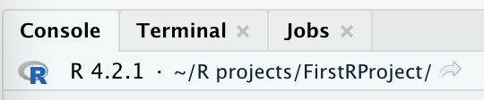
```

Escribe `R.version` en la consola y presione retorno. CP/CR.

```{r checking-your-setup-3}
question_text(NULL,
    answer(NULL, correct = TRUE),
    allow_retry = TRUE,
    try_again_button = "Edita la Respuesta",
    incorrect = NULL,
    rows = 3)
```

Esto debería devolver una lista de variables, incluidas "mayores" y "menores", que te indican tu versión de R. Esta debería ser la misma que la versión que viste en la parte superior izquierda de la consola. `R.version` no incluye paréntesis al final. Es una constante de R incorporada, no una función.

### Ejercicio 4

En breve, crearemos un nuevo proyecto para que comiences a trabajar. Antes de hacer esto, puede ser útil saber dónde te encuentras ahora.

En R Console, ejecuta `getwd()`. CP/CR.

```{r checking-your-setup-4}
question_text(NULL,
    answer(NULL, correct = TRUE),
    allow_retry = TRUE,
    try_again_button = "Edita la Respuesta",
    incorrect = NULL,
    rows = 3)
```

### 

Esta función devuelve la ruta a tu directorio de trabajo en R. Una ruta es simplemente el camino que usarías para llegar a una ubicación en tu ordenador. En este caso, si quisieras encontrar la carpeta desde la que se ejecuta R, seguirías la ruta devuelta por `getwd()`.

Se puede encontrar más información sobre las rutas en el [sitio web de UC Berkeley](https://people.ischool.berkeley.edu/~kevin/unix-tutorial/section3.html).

### Ejercicio 5

Cada vez que inicies un nuevo Proyecto de R, querrás almacenarlo en una ubicación que puedas encontrar fácilmente. En este momento, es probable que esté en un lugar aislado en tu ordenador. Sería mucho más útil tener una ubicación dedicada a tus Proyectos de R.

Hagamos una carpeta y llámela `proyectos`

Si necesitas ayuda para crear una carpeta, puedes encontrar recursos útiles [aquí](https://www.tutorialspoint.com/ubuntu/ubuntu_files_and_folders.htm) para Linux, [aquí](https://support.apple.com/guide/mac-help/organize-files-using-folders-mh26885/mac) para macOS y [aquí](https://support.microsoft.com/en-us/office/create-a-new-folder-cbbfb6f5-59dd-4e5d-95f6-a12577952e17 ) para Windows.

También sería una buena idea almacenar esta carpeta en tu escritorio, para que puedas encontrarla fácilmente. **NOTA: No almacenes esta carpeta dentro de un directorio de almacenamiento en la nube como OneDrive.** Esto puede causarte muchos problemas imprevistos en el futuro.

## Proyectos de R
###

Los buenos científicos de datos mantienen su trabajo organizado. Debes colocar tu trabajo en diferentes Proyectos de R, que son simplemente carpetas (o directorios) en tu ordenador con algunos archivos auxiliares.

### Ejercicio 1

<!-- Antecedentes: https://support.rstudio.com/hc/en-us/articles/200526207-Using-RStudio-Projects#:~:text=RStudio%20projects%20are%20associated%20with,have%20R %20código%20y%20datos -->

Lee todas las instrucciones antes de continuar, ya que no podrás acceder a este tutorial mientras realizas tu proyecto.

Haz clic en `File -> New Project` (`Archivo -> Nuevo proyecto`) en el menú principal:

```{r}
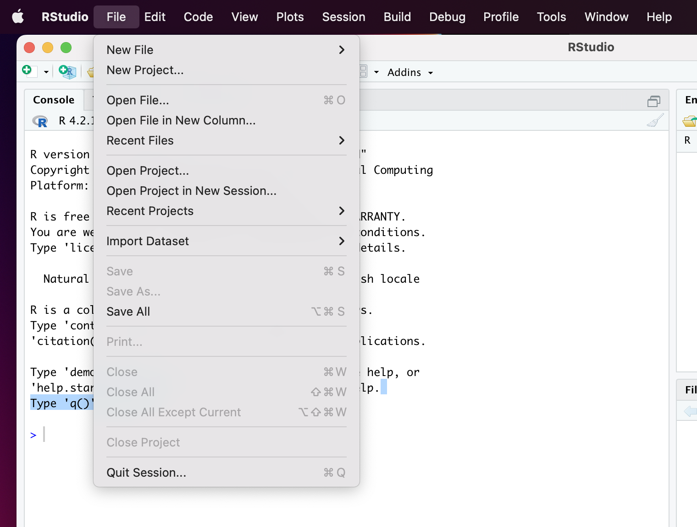
```

Selecciona `New Directory` (`Nuevo Directorio`):

```{r}
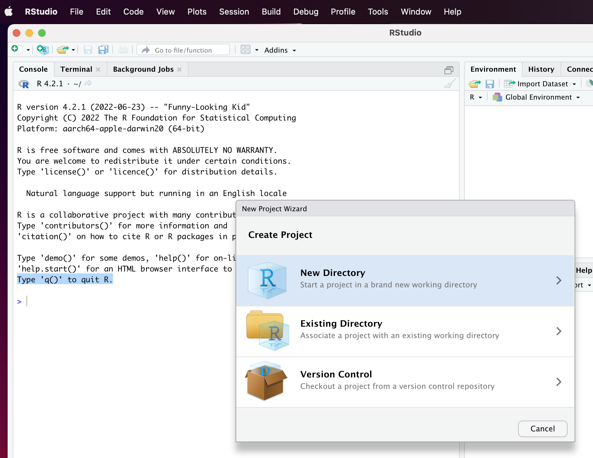
```

Selecciona `New Project` (`Nuevo Proyecto`):

```{r}
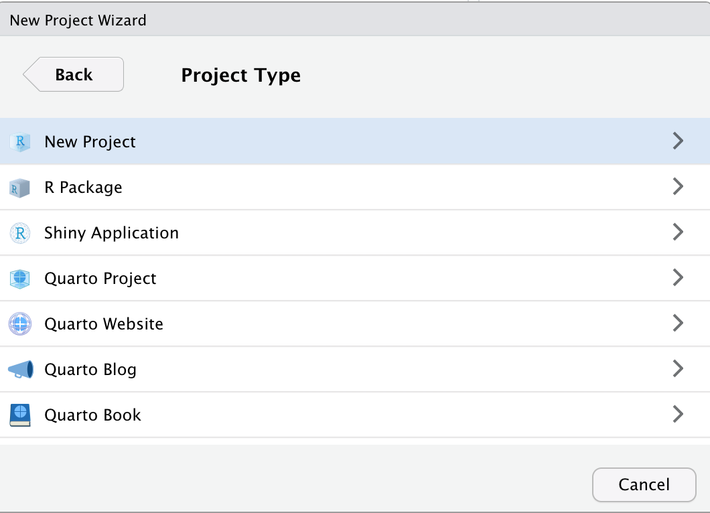
```

Sí, es confuso que esta sea la segunda vez que seleccionas `New Project` (`Nuevo proyecto`). Nombra el Proyecto `análisis-1` y cambia el subdirectorio del proyecto a tu nueva carpeta de `proyectos`.

```{r}
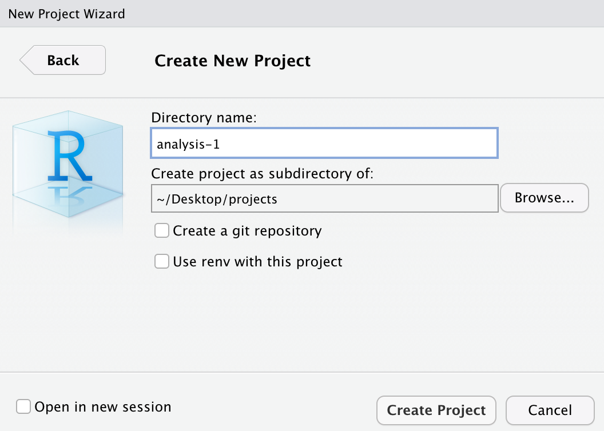
```

Haz clic en `Create Project` (`Crear proyecto`). Recuerda el tutorial "Primeros pasos", donde vimos la advertencia "Terminate Jobs" ("Terminar trabajos"). **No hagas clic en el botón Terminate Jobs** todavía. Al hacerlo, se cerrará este tutorial. Echa un vistazo a nuestro gif primero.

<!-- DK: Need a new gif which uses the File menu to start things. -->

```{r}
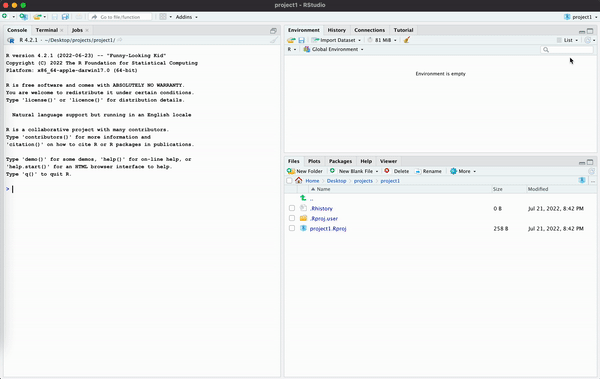
```

Continúa y haz clic en "Terminar trabajos". Deberás reiniciar el tutorial pero, una vez que lo hagas, estarás en este nuevo proyecto. Para el resto de este tutorial, trabajaremos en `análisis-1`.

###

Ejecute `getwd()`. CP/CR.

```{r r-projects-1}
question_text(NULL,
    answer(NULL, correct = TRUE),
    allow_retry = TRUE,
    try_again_button = "Edita la Respuesta",
    incorrect = NULL,
    rows = 3)
```

### 

Esta ruta ahora debería ser diferente a nuestra ruta anterior, similar a la ruta a continuación. Crear/abrir un Proyecto de R mueve la sesión de R a ese directorio.

```{r}
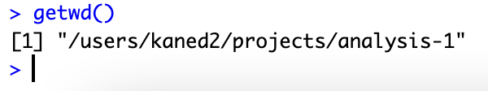
```

### 

Si tu ruta no incluye tu carpeta `proyectos`, probablemente no seleccionaste el directorio `proyectos` al crear el `análisis-1`.

### Ejercicio 2

Ejecuta `list.files()`. CP/CR.

```{r r-projects-2}
question_text(NULL,
    answer(NULL, correct = TRUE),
    allow_retry = TRUE,
    try_again_button = "Edita la Respuesta",
    incorrect = NULL,
    rows = 3)
```

### 

`list.files()` devuelve archivos contenidos en tu Proyecto de R actual. Esto debería devolver solo el archivo `análisis-1.Rproj`.

Mantener todos los archivos asociados con un proyecto determinado (datos de entrada, _scripts_ de R, resultados analíticos y figuras) juntos bajo un directorio es una práctica tan sabia y común que RStudio tiene soporte integrado para esto a través de proyectos.

### Ejercicio 3

Escribe `readLines("análisis-1.Rproj")` en la Consola de R y presiona enter. CP/CR.

```{r r-projects-3}
question_text(NULL,
    answer(NULL, correct = TRUE),
    allow_retry = TRUE,
    try_again_button = "Edita la Respuesta",
    incorrect = NULL,
    rows = 3)
```

###

Esto debería devolverte líneas que contengan algunas configuraciones básicas para tu Proyecto de R. Por ejemplo, `RestoreWorkspace` está configurado como `default` (`predeterminado`).

## Secuencias de comandos de R (_scripts_)
###

Hasta ahora, solo hemos trabajado en la Consola de R, pero es bastante difícil escribir más de unas pocas líneas de código en la Consola a la vez.

Una solución son las **secuencias de comandos de R** (o "_scripts_ de R"). Estos son archivos que contienen una copia permanente de nuestro código.

### Ejercicio 1

Crea un script de R haciendo clic en el menú desplegable `File -> New File` (`Archivo -> Nuevo archivo`) en la parte superior izquierda de tu sesión de RStudio y seleccionando "R Script".

```{r}
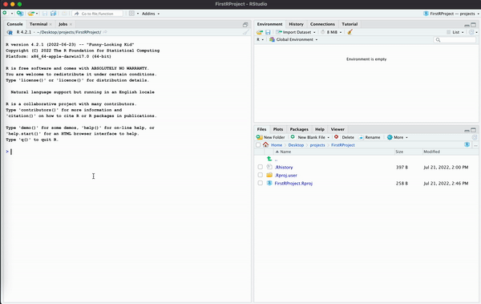
```

### 

Debería aparecer un archivo vacío y sin título encima de la Consola de R. Este es tu archivo de script de R. También puedes crear un nuevo script de R usando el atajo de teclado `Cmd/Ctrl + Shift + N`. El uso de `Cmd/Ctrl` aquí significa que los usuarios de Apple escriben la tecla Comando y los usuarios de Linux o Windows escriben la tecla Control.

###

Escribe `5 * 5` en tu archivo de script de R y ejecuta el archivo haciendo clic en el botón "Fuente" en la esquina superior derecha. Esto ejecutará todo su código en la Consola. CP/CR.

```{r r-scripts-1}
question_text(NULL,
    answer(NULL, correct = TRUE),
    allow_retry = TRUE,
    try_again_button = "Edita la Respuesta",
    incorrect = NULL,
    rows = 2)
```

### 

Tu respuesta debería parecerse a esto:

````
> source("~/.active-rstudio-document", echo=TRUE)

> 5 * 5
[1] 25
> 
````


### 

El `5 * 5` debería haberse ejecutado en tu Consola de R. El valor retornado es `25`. Siempre que ejecutes un archivo de script de R presionando el botón "Fuente", Rstudio enviará todo el código del archivo a la Consola de R, como si lo hubieras vuelto a escribir todo allí y presionado retorno.

### Ejercicio 2

A menudo hay combinaciones de "teclas de atajo" que realizan la misma tarea que hacer clic en un botón. Coloca el cursor dentro de la ventana del script de R y presiona o usa el atajo de teclado `Cmd/Ctrl + Shift + Enter`.

###

Esto hace lo mismo que presionar el botón "Source" ("Fuente"). CP/CR.

```{r r-scripts-2}
question_text(NULL,
    answer(NULL, correct = TRUE),
    allow_retry = TRUE,
    try_again_button = "Edita la Respuesta",
    incorrect = NULL,
    rows = 2)
```

### 

El uso de teclas de acceso directo es más rápido y más profesional que hacer clic en los botones.

### Ejercicio 3

En tu script de R, escribe `6 + 3` en la línea después de `5 * 5`. Si haces "source" en este archivo, todas las líneas se ejecutarán. Inténtalo. CP/CR.

```{r r-scripts-3}
question_text(NULL,
    answer(NULL, correct = TRUE),
    allow_retry = TRUE,
    try_again_button = "Edita la Respuesta",
    incorrect = NULL,
    rows = 2)
```

### 

El resultado que ves es el mismo que sucedería si copiaras cada línea en la Consola y presionaras retorno después de cada una.

### Ejercicio 4

En lugar de obtener el archivo completo, podemos simplemente ejecutar (o "run"/correr) una sola línea. En tu script de R, coloca el cursor en la misma línea que `6 + 3` y haz clic en el botón "Run" a la izquierda del botón "Source". CP/CR.

```{r r-scripts-4}
question_text(NULL,
    answer(NULL, correct = TRUE),
    allow_retry = TRUE,
    try_again_button = "Edita la Respuesta",
    incorrect = NULL,
    rows = 2)
```

### 

En lugar de ejecutarse ambas líneas en el script, solo se ejecuta la segunda línea. Y el proceso por el cual esto sucede no tiene nada que ver con todo el script. _Run_ no es lo mismo que _Source_. Con _Run_, solo estás copiando/pegando una línea del script, o el texto que hayas sombreado haciendo una selección parcial, a la Consola de R.

### Ejercicio 5

La tecla de atajo para ejecutar una sola línea de código es `Cmd/Ctrl + Enter`. En tu script de R, coloca el cursor en la misma línea que `5 * 5` y presiona `Cmd/Ctrl + Enter`. CP/CR.

```{r r-scripts-5}
question_text(NULL,
    answer(NULL, correct = TRUE),
    allow_retry = TRUE,
    try_again_button = "Edita la Respuesta",
    incorrect = NULL,
    rows = 2)
```

### 

`Cmd/Ctrl + Enter` es probablemente la tecla de atajo más utilizada porque es muy útil para ejecutar tu código línea a línea.

En lugar de ejecutar tu código expresión a expresión, también puedes ejecutar el script completo en un solo paso con `Cmd/Ctrl + Shift + S`. Hacer esto regularmente es una excelente manera de asegurarse de haber capturado todas las partes importantes de tu código en el script. Pero ten en cuenta que esta tecla de atajo no es lo mismo que _Source_. En particular, _Source_ hace que se repita cada comando en el script.

<!-- DK: Lo anterior es difícil de seguir. ¿Con qué frecuencia la gente usa `Cmd/Ctrl + Shift + S`? -->

### Ejercicio 6

Regresa a la primera línea en tu script de R. Cambia `5 * 5` a `x <- 5 * 5`, creando así un objeto llamado `x` con un valor de 25. Haz clic en el botón "Source".

###

En la pestaña de la Consola de R, ejecuta `ls()`. CP/CR.

```{r r-scripts-6}
question_text(NULL,
    answer(NULL, correct = TRUE),
    allow_retry = TRUE,
    try_again_button = "Edita la Respuesta",
    incorrect = NULL,
    rows = 2)
```

### 

`ls()` devuelve una lista de objetos presentes en tu entorno. Estos son los mismos objetos que se muestran en la pestaña _Environment_ (Entorno) en la esquina superior derecha de RStudio. Deberías ver que se mostró `x`, porque tu definiste `x` usando tu script de R.

### Ejercicio 7

Hasta ahora, hemos estado trabajando en un archivo no guardado. En la parte superior del panel de Código, el archivo debería llamarse actualmente `Untitled1` (`Sin título1`). Verás que el texto está en rojo, con un asterisco. Esto indica que hay cambios no guardados en el archivo.

```{r}
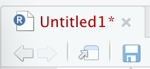
```

### 

Elimina todo el código que hay actualmente en tu archivo de script de R. Luego haz clic en el ícono de guardar debajo del título del script, o usa el atajo `Cmd/Ctrl + s` para guardar el script. La primera vez que guardes un archivo, también le asignarás un nombre. Llamemos a este archivo `script-1`. El sufijo `.R` se agrega automáticamente.

En la Consola, ejecuta `list.files()`. CP/CR.

```{r r-scripts-7}
question_text(NULL,
    answer(NULL, correct = TRUE),
    allow_retry = TRUE,
    try_again_button = "Edita la Respuesta",
    incorrect = NULL,
    rows = 2)
```

### 

Recuerda que cuando ejecutamos esto anteriormente en el tutorial, solo se mostró el archivo `análisis-1.Rproj`. Ahora también debería mostrarse el archivo `script-1.R`.

### Ejercicio 8

Ahora que estamos puestos y comenzamos a trabajar con scripts de R, comencemos a dibujar gráficos. Estaremos haciendo el siguiente gráfico, paso a paso.

```{r}
hist_p <- ggplot(data = diamonds, 
                 mapping = aes(x = carat)) +
  geom_histogram(bins = 100,
                 color = "white") + 
  labs(title = "Histograma de Carat (Peso) entre 50,000 Diamantes", 
       subtitle = "Son muy comunes los carats justo en, o encima de, números significativos", 
       x = "Carat", 
       y = "Conteo", 
       caption = "conjunto de datos diamantes del paquete ggplot2 traducido en github en cienciadedatos/datos")

hist_p
```

### 

En la parte superior de tu archivo de script de R, escribe

```{r eval = FALSE, echo = TRUE}
library(tidyverse)
```

Ejecuta el archivo completo con `Cmd/Ctrl + Enter`. Luego usa la función `search()` en tu Console de R. CP/CR.

```{r r-scripts-8}
question_text(NULL,
    answer(NULL, correct = TRUE),
    allow_retry = TRUE,
    try_again_button = "Edita la Respuesta",
    incorrect = NULL,
    rows = 2)
```

### 

Esta función devuelve una lista de paquetes cargados en memoria de R. Esto debería incluir el texto `package:tidyverse`.

### Ejercicio 9

En la siguiente línea, inicia un `ggplot()`, configurando `data` a `diamonds` y mapeando `x` a `carat` con el siguiente código.

```{r eval = FALSE, echo = TRUE}
ggplot(data = diamonds,
       mapping = aes(x = carat))
```

Vuelve a ejecutar todo el archivo. Esto debería generar un gráfico en blanco en la pestaña "Plots" ("Gráficos") en la parte inferior derecha de tu sesión de RStudio.

###

En la consola, ejecuta `readLines("script-1.R")`. CP/CR.

```{r r-scripts-9}
question_text(NULL,
    answer(NULL, correct = TRUE),
    allow_retry = TRUE,
    try_again_button = "Edita la Respuesta",
    incorrect = NULL,
    rows = 2)
```

### 

`ggplot()` generará solo un gráfico en blanco hasta que se agregue una capa `geom`. Ten en cuenta que puedes recibir una advertencia al usar `readLines()` si `script-1.R` no termina con una línea en blanco. Esta advertencia no nos importa, pero siempre es una buena práctica terminar un archivo de texto con una línea en blanco.

### Ejercicio 10

Agrega una capa con `geom_histogram()`. Cambia el color del borde en nuestro gráfico a blanco configurando `color` a `"white"` dentro de `geom_histogram`, y cambia el número de columnas en nuestro diagrama configurando el argumento `bins` a `100`.

```{r eval = FALSE, echo = TRUE}
geom_histogram(bins = 100,
               color = "white")
```

Ejecuta el archivo (clicando en "Run", fíjate en el descuido de esta instrucción anterior). "Ejecutar" un script generalmente significa "procesarlo", es decir, enviarlo al proceso de R. Hemos aprendido dos formas de ejecutar (fácilmente) un archivo completo: presionando el botón "Source" o presionando `Cmd/Ctrl + Shift + Enter`.

###

Esto debería generar columnas en tu gráfico. ¿Recordaste colocar un `+` después de la llamada `ggplot()` y antes de la capa `geom_histogram()`?

###

En la pestaña de la Consola de R, ejecuta `readLines("script-1.R")`. CP/CR.

```{r r-scripts-10}
question_text(NULL,
    answer(NULL, correct = TRUE),
    allow_retry = TRUE,
    try_again_button = "Edita la Respuesta",
    incorrect = NULL,
    rows = 2)
```

### 

Ten en cuenta que el argumento `color` que se usa aquí modifica el color del borde de nuestras columnas. Para cambiar el color del relleno, utiliza el argumento `fill` (`relleno`).

### Ejercicio 11

Ahora hagamos que nuestro gráfico se vea un poco mejor agregando una capa `labs()` con un título, subtítulo y etiquetas de eje apropiadas.

Recordatorio, así es como debería verse nuestro gráfico

```{r}
hist_p
```

Ejecuta tu archivo de script de R para ver tu trama completa. Nuevamente, ¡fíjate en el lenguaje aquí! Anteriormente, hicimos una distinción entre los botones "Source" y "Run" de arriba --- y esa distinción es real. Sin embargo, en lenguaje casual, usamos la palabra"run" ("ejecutar") para significar genéricamente "Dile al ordenador que ejecute los comandos en este archivo". No necesariamente nos importa cómo se logra eso.

###

En la pestaña de la Consola de R, ejecuta `readLines("script-1.R")`. CP/CR.

```{r r-scripts-11}
question_text(NULL,
    answer(NULL, correct = TRUE),
    allow_retry = TRUE,
    try_again_button = "Edita la Respuesta",
    incorrect = NULL,
    rows = 8)
```

### 

Un buen estilo de codificación es como la puntuación correcta: puedes arreglártelas sin ella, peroseguroquehacequetodoseamásfácildeleer. Incluso como una persona que se inicia en la programación, es una buena idea trabajar en tu propio estilo de código. El uso de un estilo consistente hace que sea más fácil para los demás (¡incluido el futuro-tu!) leer tu trabajo y es particularmente importante si necesitas ayuda de otra persona.


### Ejercicio 12

Ahora tenemos el código que crea una gráfico en el `script-1`. ¿Cómo usamos este gráfico para otras cosas? En este momento tenemos que ejecutar el `script-1` cada vez que queremos ver el gráfico, lo cual es un poco engorroso.

###

Podemos usar la función `ggsave()`. Escribe `?ggsave` en la Consola de R. Esto abrirá la página de ayuda de `ggsave()`. Copia y pega la Descripción de la página de ayuda en el espacio a continuación.

```{r r-scripts-12}
question_text(NULL,
    answer(NULL, correct = TRUE),
    allow_retry = TRUE,
    try_again_button = "Edita la Respuesta",
    incorrect = NULL,
    rows = 2)
```

`ggsave()` se usa para guardar gráficos como archivos individuales, separados del código que creó el gráfico. En este caso usaremos el formato "png".

### Ejercicio 13

Queremos guardar nuestro gráfico completo en un objeto, lo que se puede hacer configurando nuestro gráfico igual a una variable. Llama a esta variable `hist_p`.

Ahora, usando la función `ggsave()`, podemos crear un png de nuestro diagrama a partir de nuestro código. En `ggsave()`, pon `plot` a `hist_p` y `file` a `"hist-harvard.png"`.

Tu archivo completo debería verse como:

```{r eval = FALSE, echo = TRUE}
library(tidyverse)

hist_p <- ggplot(data = diamonds, 
                 mapping = aes(x = carat)) +
  geom_histogram(bins = 100,
                 color = "white") + 
  labs(title = "Histograma de Carat (Peso) entre 50,000 Diamantes", 
       subtitle = "Son muy comunes los carats justo en, o encima de, números significativos", 
       x = "Carat", 
       y = "Conteo", 
       caption = "conjunto de datos diamantes del paquete ggplot2 traducido en github en cienciadedatos/datos")

ggsave(plot = hist_p, file = "hist-harvard.png")
```

### 

Ejecuta tu código.

### 

En la Consola de R, ejecuta `list.files()`. CP/CR.

```{r r-scripts-13}
question_text(NULL,
    answer(NULL, correct = TRUE),
    allow_retry = TRUE,
    try_again_button = "Edita la Respuesta",
    incorrect = NULL,
    rows = 2)
```

### 

Deberías ver el archivo `hist-harvard.png` que contiene tu gráfico. En la esquina inferior derecha de tu espacio de trabajo en la pestaña `Archivos`, haz clic en el archivo `hist-harvard.png` para ver tu gráfico.

Si el texto del título sale de la imagen, es posible que desees modificar el argumento `scale` (`escala`) en `ggsave()` para encontrar un mejor tamaño de imagen. `scale` toma el valor 1 de forma predeterminada.


## Quarto 1
### 

Quarto is a file format for making dynamic documents with R and other languages, like Python. To learn more about Quarto and how to use it, check out the [official webpage](https://quarto.org/)! Quarto is the successor technology to [R Markdown](https://rmarkdown.rstudio.com/).

### Exercise 1

Click `File -> New File` at the top left of your RStudio window, and select "Quarto Document...". You will be offered the option of providing a "Title" and "Author" for the document. **Note that the title of a document has no necessary connection to the name of the file itself.** Add "My First Quarto Document" as the title and your name as the author. Click `Create`.

```{r}
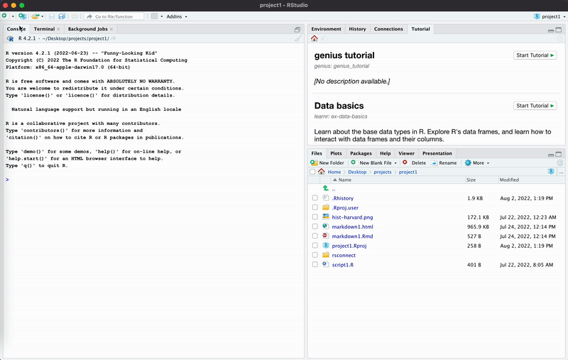
```

### 

Run `list.files()`. CP/CR.

```{r quarto-1-1}
question_text(NULL,
    answer(NULL, correct = TRUE),
    allow_retry = TRUE,
    try_again_button = "Edita la Respuesta",
    incorrect = NULL,
    rows = 2)
```

### 

Since we have not saved the file yet, it does not appear in this listing. 

Quarto is a command line interface tool, not an R package. This means that help is, by-and-large, not available through `?`. Instead, as you work through this tutorial, and use Quarto in the future, you should refer to the [Quarto documentation](https://quarto.org/). 


### Exercise 2

Save the Quarto document by clicking the disk icon at the top of the file, or by using the shortcut `Cmd/Ctrl + s`. Name the file `quarto-1`. The `.qmd` file extension will be added automatically. 

Now that the document is saved, run `list.files()`. CP/CR.

```{r quarto-1-2}
question_text(NULL,
    answer(NULL, correct = TRUE),
    allow_retry = TRUE,
    try_again_button = "Edita la Respuesta",
    incorrect = NULL,
    rows = 2)
```

### 

This should return `quarto-1.qmd`, as well as `análisis-1.Rproj`, `script-1.R`, and `hist-harvard.png`. Note how different suffixes are used for different types of files.


### Exercise 3

In the top left corner above your Quarto document, you should see the buttons "Source", and "Visual". Click on "Source". This will revert how we see our Quarto document to be more similar to our R script. We will explore the "Visual" option shortly.


```{r quarto-1-3}
question_text(NULL,
	answer(NULL, correct = TRUE),
	allow_retry = TRUE,
	try_again_button = "Edita la Respuesta",
	incorrect = NULL,
	rows = 3)
```

### 

<!-- DK: This could go somewhere else. -->

It might be tempting to name your files `code.R` or `myscript.R`, but you should think a bit harder before choosing a name for your file. Three important principles for file naming are as follows:
  
* File names should be machine readable: avoid spaces, symbols, and special characters. Don’t rely on case sensitivity to distinguish files.

* File names should be human readable: use file names to describe what’s in the file.

* File names should play well with default ordering: start file names with numbers so that alphabetical sorting puts them in the order they get used.


### Exercise 4

The default Quarto file should look like this:

```{r out.width = "875px"}
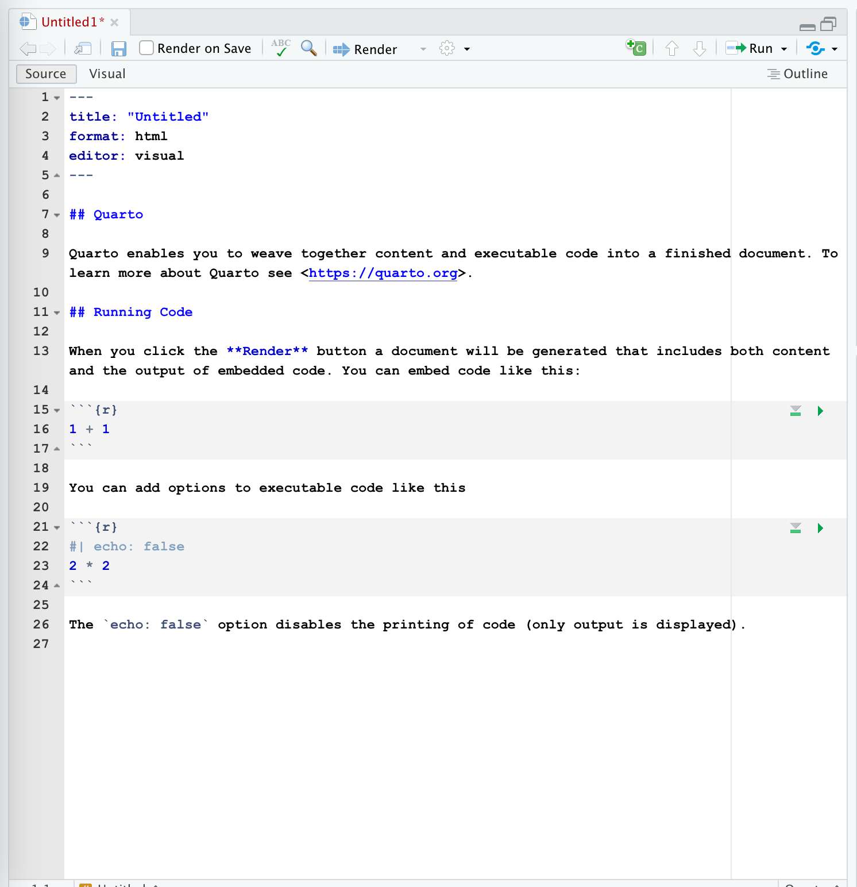
```

### 

As you can see, a lot of the text is regular plain text, not code. However, there are code chunks which allow us to execute code when the document is rendered. Here's an example of an R code chunk:

```{r}
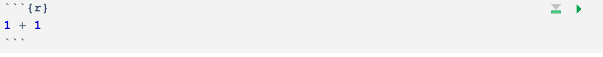
```

Quarto documents utilize Markdown (an easy-to-write plain text format), which can contain chunks of embedded code. These code chunks can be written in many languages, including R and Python. Code chunks allow you to use R to create plots and other graphics, and then to display them in a rendered Quarto document.

### 

<!-- DK: First render as it. Discuss. Highlight the different parts. Explain echo = FALSE. Then edit it as below. Add some photos. -->

<!-- FC: students may be confused about what a YAML header is, even with the description. Might be good to include a screenshot of what the YAML looks like. -->

Delete everything except the YAML header -- the text in the box at the top of the file, as well as the dashes. Add "This is my first Markdown text." at the bottom of the document.

### 

Save the file and run `readLines("quarto-1.qmd") |> tail()`. CP/CR.

```{r quarto-1-4}
question_text(NULL,
    answer(NULL, correct = TRUE),
    allow_retry = TRUE,
    try_again_button = "Edita la Respuesta",
    incorrect = NULL,
    rows = 2)
```

### 

<!-- DK: Drop some knowledge. Split up some of the paragraphs. -->

This should return the last 6 lines of your Quarto document.

Quarto files are designed to be used in three ways:

* For communicating to decision-makers, who want to focus on the conclusions, not the code behind the analysis.

* For collaborating with other data scientists (including future you!), who are interested in both your conclusions, and how you reached them (i.e. the code).

* As an environment in which to do data science, as a modern-day lab notebook where you can capture not only what you did, but also what you were thinking.

### Exercise 5

The main advantage of a Quarto document, relative to a simple R script, is to create something which is a mixture of words and code. To "render" our Quarto document, click the "Render" arrow at the top of the Code pane, or use the shortcut `Cmd/Ctrl + shift + k`.

### 

To render is to transform a document from Markdown to some other format, e.g., html, PDF, Microsoft Word and so on.

### 

In the following box, copy all of the text from your rendered Quarto document (which appears in the Viewer tab).

```{r quarto-1-5}
question_text(NULL,
    answer(NULL, correct = TRUE),
    allow_retry = TRUE,
    try_again_button = "Edita la Respuesta",
    incorrect = NULL,
    rows = 2)
```

### 

<!-- DK: Explain about the setting we changed to achieve this. maybe change the setting and then change it back? -->

Notice how the rendered document --- which is an html file in this case --- appears in the Viewer tab in the Files pane in the lower right of the workspace.

### Exercise 6

In Quarto documents, you can use Markdown syntax. You can use this to create **bold** or *italic* text, and headers.

### 

Make the text created in the previous section a header by adding `##` at the beginning of the line (followed by a space), then adding this text under that as a description: `You can do a lot of cool things in Quarto like **bold** and *italic* text.` Render the file again. Does everything look good in the Viewer?

### 

Run `readLines("quarto-1.qmd") |> tail()` in the Console. CP/CR.

```{r quarto-1-6}
question_text(NULL,
    answer(NULL, correct = TRUE),
    allow_retry = TRUE,
    try_again_button = "Edita la Respuesta",
    incorrect = NULL,
    rows = 2)
```

### 

You can find a full list of Markdown formatting styles and commands [here](https://www.markdownguide.org/basic-syntax/).

### Exercise 7

In the top left corner of the Code pane, you should be able to see two buttons: "Source" and "Visual". "Source" shows you all the code while "Visual" shows you (mostly) how the document will look after being rendered. You can edit a Quarto document while in either "Source" or "Visual" mode.

### 

We are going to switch to "Visual" and explore how we can edit while still in "Visual". Switch to "Visual" by clicking on it.

### 

Type "I made this through Quarto" below "This is my first Markdown text" while still in "Visual". Copy and paste everything in your document (while still in "Visual") into the box below.

```{r quarto-1-7}
question_text(NULL,
    answer(NULL, correct = TRUE),
    allow_retry = TRUE,
    try_again_button = "Edita la Respuesta",
    incorrect = NULL,
    rows = 2)
```

### 

Save the file. Render the document, just to make sure it worked.

### Exercise 8

Now let's try to add code chunks into our Quarto document. Under the text that we added earlier, add a code chunk either by pressing the Add Chunk command at the top of the editor (the green C button with a plus sign next to it) or with the shortcut `option + cmd + i`. The newly created code chunk will be empty, like the example from earlier.

### 

Save the file, and run `readLines("quarto-1.qmd") |> tail()` in the Console. CP/CR.

```{r quarto-1-8}
question_text(NULL,
    answer(NULL, correct = TRUE),
    allow_retry = TRUE,
    try_again_button = "Edita la Respuesta",
    incorrect = NULL,
    rows = 2)
```

### 

This should show the code chunk you created.

### Exercise 9

<!-- DK: Use palmer penguins? -->

Let's try graphing the **iris** data within our code chunk. First of all, we need to load the libraries that we need.

### 

We will often make a "setup" code chunk when we begin working in a file, where we can load libraries and prepare data for use. At the top of the file, directly below the YAML header, create another code chunk, as seen below.

In the setup code chunk, use the `library()` function with the argument **tidyverse**. Always label your code chunks. Adding a label makes code chunks easier to sort and understand. Your setup chunk should look like this:

```{r}
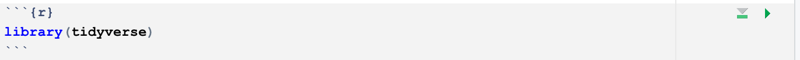
```

### 

**Important Point**: There are two different "worlds" with which we are dealing. First is the world of the Quarto document, the qmd file. Second is the world of the Console in our current RStudio session. **These worlds only connect when we connect them**. Something written in a Quarto document --- or an R script --- is not part of our current R session.

### 

Right now, your libraries haven't been loaded into the current R session. To load them, you must run the code chunk. This can be done using the Run button in the top right of your qmd file, or with the shortcut cmd + shift + enter.

Run the code chunk.

### 

Run `readLines("quarto-1.qmd") |> head(15)` in the Console. CP/CR.

```{r quarto-1-9}
question_text(NULL,
    answer(NULL, correct = TRUE),
    allow_retry = TRUE,
    try_again_button = "Edita la Respuesta",
    incorrect = NULL,
    rows = 2)
```

### 

Whenever we use `library()` in our Quarto documents, we will use a setup code chunk. Do not load libraries in the same chunk as your plots.

### Exercise 10

Go back to the code chunk that you first created. Let's create the following scatterplot in our Quarto document:

```{r}
scat_p <- ggplot(data = iris, 
                 mapping = aes(x = Sepal.Width, 
                               y = Sepal.Length, 
                              color = Species)) +
  geom_point() +
  labs(title = "Measurements for Different Species of Iris",
       subtitle = "Virginica has the longest sepals",
        x = "Sepal.Width",
        y = "Sepal.Length", 
       caption = "Fisher (1936)")
scat_p
```

This graph should be similar to ones you have created in previous visualization tutorials.

### 

Copy the code below into your R Code Chunk.

```{r eval = FALSE, echo = TRUE}
ggplot(data = iris, 
       mapping = aes(x = Sepal.Width, 
                     y = Sepal.Length, 
                     color = Species))
```

### 

Render the file. You should now see your R code chunk, as well as a blank plot, since we have not added a geom layer.

Run `readLines("quarto-1.qmd") |> tail(10)` in the Console. CP/CR.

```{r quarto-1-10}
question_text(NULL,
    answer(NULL, correct = TRUE),
    allow_retry = TRUE,
    try_again_button = "Edita la Respuesta",
    incorrect = NULL,
    rows = 2)
```

### Exercise 11

To add a geom layer, add `geom_point()` to your plot. You will need to render the file again. Now our plot isn't empty! It shows a scatterplot!

### 

Run `readLines("quarto-1.qmd") |> tail(10)` in the Console. CP/CR.

```{r quarto-1-11}
question_text(NULL,
    answer(NULL, correct = TRUE),
    allow_retry = TRUE,
    try_again_button = "Edita la Respuesta",
    incorrect = NULL,
    rows = 2)
```

### 

<!-- DK: Drop some knowledge! -->

The output should include the last 10 lines of code in your Quarto document.

### Exercise 12

We just built the basic graph, but it still looks a little ugly. Labels are important for adding context to the graph and making it easier to understand.

Use the `labs()` function to add appropriate title and axis labels to the graph.

Reminder, this is what our plot should look like

```{r echo = FALSE}
scat_p
```

### 

Render the file again to see your completed graph.

### 

Run `readLines("quarto-1.qmd") |> tail(10)` in the Console. CP/CR.

```{r quarto-1-12}
question_text(NULL,
    answer(NULL, correct = TRUE),
    allow_retry = TRUE,
    try_again_button = "Edita la Respuesta",
    incorrect = NULL,
    rows = 2)
```

### Exercise 13

Now, we just used a code chunk because we wanted to do a full graph. An R code chunk limits you from using R code in the same line as text. This is when we use **inline** R code.

Inline R code is essentially a way for you to put simple R calculations in the same line as your text. Add the following code to your setup code chunk.

```{r echo = FALSE}
x <- 1234567890
```

The setup chunk should now look like this.

```{r}
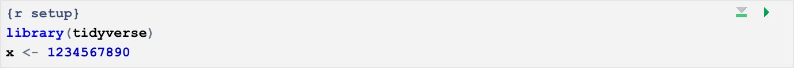
```

### 

Run the code chunk, then in the Console, type `x` to verify that x has been defined. CP/CR.

```{r quarto-1-13}
question_text(NULL,
    answer(NULL, correct = TRUE),
    allow_retry = TRUE,
    try_again_button = "Edita la Respuesta",
    incorrect = NULL,
    rows = 2)
```

### Exercise 14

Lets make some inline R code.

Into your Quarto document, directly after the code chunk we just made, type the following text and inline R code. **NOTE**: Type this manually, do not copy. Pasted code can be finicky, and might not register as inline R code.

The variable x has a value of: `` `r knitr::inline_expr("scales::comma(x)")` ``.

### 

<!-- DK: Fix this image. -->

<!-- Render the file. You should see that the line now looks like, -->

<!-- ```{r} -->

<!--  -->

<!-- ``` -->

<!-- ###  -->

As you can see, it's just a condensed version of a full code chunk. We declare the language (R) and then state our function (`scales::comma(x)`). By doing this, we can put R code in the same line as actual text. Remember that we use backticks to signify code here.

### 

Run `readLines("quarto-1.qmd") |> tail(10)` in the Console. CP/CR.

```{r quarto-1-14}
question_text(NULL,
    answer(NULL, correct = TRUE),
    allow_retry = TRUE,
    try_again_button = "Edita la Respuesta",
    incorrect = NULL,
    rows = 2)
```

### 

Instead of hardcoding values into text in your Markdown file, you should always try to calculate values on the fly using inline R code. This ensures that values will always be accurate, regardless of changes to given data sets. For more info on inline R code, look at the [Quarto Execution Options Guide](https://quarto.org/docs/computations/execution-options.html).

### Exercise 15

<!-- DK: Add an image. -->

<!-- DK: Awkward! Show an example. -->

Right now, our Quarto document looks a little ugly. We don't want our code to be displayed in the rendered report. We can get rid of it using code chunk arguments.

Code chunk arguments are a way to tell a chunk what it should do when rendered. Code chunk options are written below the `{r}` in our code chunk. Let's change `echo` to `false` to stop the code from showing in our report. `echo` like `label` is a code chunk option. Code chunk options are prefaced with a `#|`, called a "hash-pipe." After the name of the option, you place a colon, followed by the value for the option.

Run `readLines("quarto-1.qmd")` in the Console, then copy-paste the command and the output below.

```{r quarto-1-15}
question_text(NULL,
    answer(NULL, correct = TRUE),
    allow_retry = TRUE,
    try_again_button = "Edita la Respuesta",
    incorrect = NULL,
    rows = 2)
```

### 

Some more useful code chunk options to look into include `warning` and `message`. A full list of code chunk options can be found on the [Quarto Execution Options Guide](https://quarto.org/docs/computations/execution-options.html). We will almost always use `echo: false` to hide code in our projects.

### 

Congratulations on creating a full Quarto document. You have learned how to create plots, add text, and use inline R code.

## Quarto 2
<!-- DK: Drop some knowledge. Tell us about the options now, and at the end, after you have taught them to us. -->

Now let's make another Quarto document, and explore some more options!

### Exercise 1

Make a new Quarto document. Name the document `quarto-2`, and instead of creating the document as normal, hit "Create Empty Document", in the bottom left corner of the creation screen.

```{r}
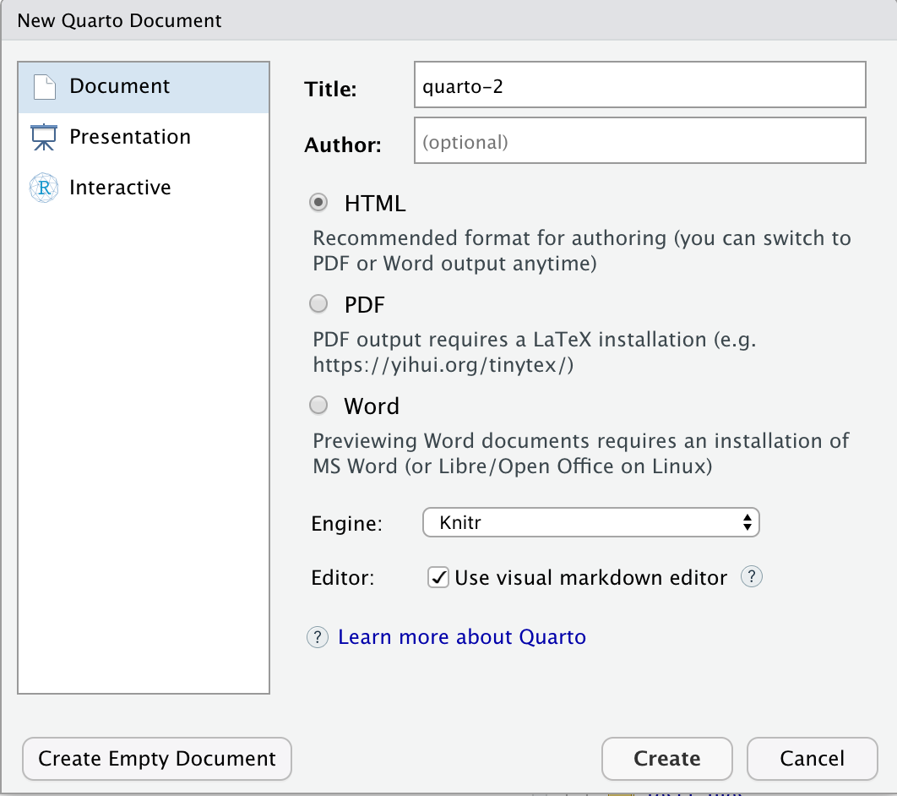
```

Save the document as `quarto-2`. Run `readLines("quarto-2.qmd")`. CP/CR.

```{r quarto-2-1}
question_text(NULL,
    answer(NULL, correct = TRUE),
    allow_retry = TRUE,
    try_again_button = "Edita la Respuesta",
    incorrect = NULL,
    rows = 2)
```

### 

<!-- DK: Drop knowledge! -->

The document should be completely empty, apart from the YAML header

### Exercise 2

We are going to make another setup code chunk, where you can load all the libraries you need. Add a new code chunk with the green C at the top of the page.

### 

You may notice that there are curly braces `{}` at the top of the chunk, with an `r` inside. The `r` says that the language is R. In the next line, write `#| label: setup` in order to give the code chunk the label/name "setup."

### 

We don't need very many libraries for this, as we are just including images, but we do need the package **knitr**. Load **knitr** with `library(knitr)` in your setup chunk. (Recall that the terms "library" and "package" are used interchangeably.)

### 

**Notice the sloppy language!** There are two ways in which we can "load" **knitr**, corresponding to the two worlds we are working in simultaneous: QMD World and Console World.

### 

Putting the character string `library(knitr)` inside the `setup` code chunk is enough to "load" **knitr** in QMD World because, whenever we render a file, every line of code in the file is set to R for processing. Those characters, however, have no connection to Console World until we explicitly execute them by hand, generally with Cmd/Cntrl-return.

Do that now. Place the cursor next to the `library()` function calls and hit Cmd/Cntrl-return.

### 

Once all that is done, run `search()` in the Console. CP/CR

```{r quarto-2-2}
question_text(NULL,
    answer(NULL, correct = TRUE),
    allow_retry = TRUE,
    try_again_button = "Edita la Respuesta",
    incorrect = NULL,
    rows = 2)
```

### 

<!-- DK: Explain this better! Not actually loaded unless you execute the code! -->

This should include the string `package:knitr`, indicating that **knitr** is loaded.

### Exercise 3

Make a new header with the title "Harvard Histogram". Remember we do this using `##`, followed by a space. Under this header, create a new code chunk. Use the code chunk argument `echo: false` to stop your code from showing up upon rendering the file.

### 

In your new code chunk, use the function `include_graphics()`. Set the argument to the name of your .png. Remember to use quotes. The command should look like `include_graphics("hist-harvard.png")`.

### Exercise 4

Remember the **iris** graph that we made? We are going to include that in the Quarto document along with the Harvard graph that we made. Make a header with the title "Iris scatter plot". Now, we need to save the graph to an object.

### 

Go back to the `quarto-1` document and copy and paste the code for the iris plot into the `quarto-2` document in a new code chunk labeled `iris`. Add the `echo: false` code chunk option as well. Save the file.

### 

Run `readLines("quarto-2.qmd")` in the Console. CP/CR.

```{r quarto-2-4}
question_text(text = NULL,
    answer(NULL, correct = TRUE),
    allow_retry = TRUE,
    try_again_button = "Edita la Respuesta",
    incorrect = NULL,
    rows = 2)
```

### Exercise 5

Now that you have the code for the iris plot in your document, we are going to save it to an object. Call the object `iris_plot`.

### 

Run `readLines("quarto-2.qmd")` in the Console again. CP/CR.

```{r quarto-2-5}
question_text(NULL,
    answer(NULL, correct = TRUE),
    allow_retry = TRUE,
    try_again_button = "Edita la Respuesta",
    incorrect = NULL,
    rows = 2)
```

### Exercise 6

Now, let's make the `iris_plot` into a .png using `ggsave()`.

### 

We are going to do it the same way as the Harvard plot. In a new code chunk labeled `iris_save`, type `ggsave()`. Set `plot` equal to `iris_plot`, and `file` equal to `"iris_plot.png"`. Now you have another .png to include in your `quarto-2` document.

### 

Now, we need to include the plot!

### 

In another code chunk called `iris_include`, type `include_graphics("iris_plot.png")`.

### 

Run `readLines("quarto-2.qmd")` in the Console. CP/CR.

```{r quarto-2-6}
question_text(NULL,
    answer(NULL, correct = TRUE),
    allow_retry = TRUE,
    try_again_button = "Edita la Respuesta",
    incorrect = NULL,
    rows = 2)
```

### Exercise 7

Now, we are going to include more inline R code.

### 

In a new code chunk set `x` to `1234567890` with `<-`. Make sure to add the code chunk option `echo: false`.

### 

Now, we want the inline code to show in the document. Type x in the Console to make sure it is `1234567890`. (For this to work, you must also run the `x <- 1234567890` code in the Console, presumably using Cmd/Cntrl-return.)

### 

Now, you need to **TYPE** this into your document. Type it underneath the `iris_plot` code chunk. This does **not** go in a code chunk though.

The variable x has a value of: `` `r knitr::inline_expr("scales::comma(x)")` ``.

### 

Render the document. When you do, you should see your inline code at the bottom. It should look like this:

The variable x has a value of: `r scales::comma(x)`.

### 

Run `readLines("quarto-2.qmd")` in the Console. CP/CR.

### Exercise 8

Render the file, and take a look at your completed Quarto document. It should now include your `iris` graph, the `x` text, and your Harvard graphic.

Run `readLines("quarto-2.qmd") |> tail(10)` in the Console. CP/CR.

```{r quarto-2-8}
question_text(NULL,
    answer(NULL, correct = TRUE),
    allow_retry = TRUE,
    try_again_button = "Edita la Respuesta",
    incorrect = NULL,
    rows = 2)
```

## Publishing
### 

We'll be publishing our Quarto documents on the Internet by using Rpubs](https://rpubs.com/, a free web publishing service. Rpubs is managed by Posit (formerly RStudio), a leading company in the data science world. You will need to create an Rpubs account.

### 

Sometime in the future, Rpubs will go away and be replaced by [Quarto Pub](https://quartopub.com/). But that has not (?) happened yet. Some of the images in this Section may be out of date.

### Exercise 1

Render the `quarto-2` file. By rendering, you are generating a report in HTML, which is what Rpubs publishes on the web.

### 

Run `list.files()` in the Console, then copy-paste the command and the result below.

```{r publishing-1}
question_text(NULL,
    answer(NULL, correct = TRUE),
    allow_retry = TRUE,
    try_again_button = "Edita la Respuesta",
    incorrect = NULL,
    rows = 2)
```

### 

You should see a `quarto-2.html` file, which generates upon rendering your qmd. (Note that the "qmd" file extension stands for **Q**uarto **M**arkdown **D**document.)

### 

We sometimes edit the YAML header to get rid of information like the date and title, as it sometimes looks bad in the final render. However, make sure not to mess with the rest of the YAML formatting because it is a very structurally sensitive language. You can learn more about YAML editing at [bookdown.org](https://bookdown.org/yihui/bookdown/r-markdown.html).

### Exercise 2

Notice a blue icon in the upper right-hand corner of your Quarto document. It should look like the image below.

```{r out.width = "875px"}

```

Press that button.

<!-- DK: Poor organization. What are students submitting? -->

### Exercise 3

You will be asked whether you want to publish to Rpubs or to Posit Connect. Use Rpubs. (Posit Connect costs money.) You will get a reminder that all documents you publish on RPubs are publicly visible. Click "Publish".

```{r}
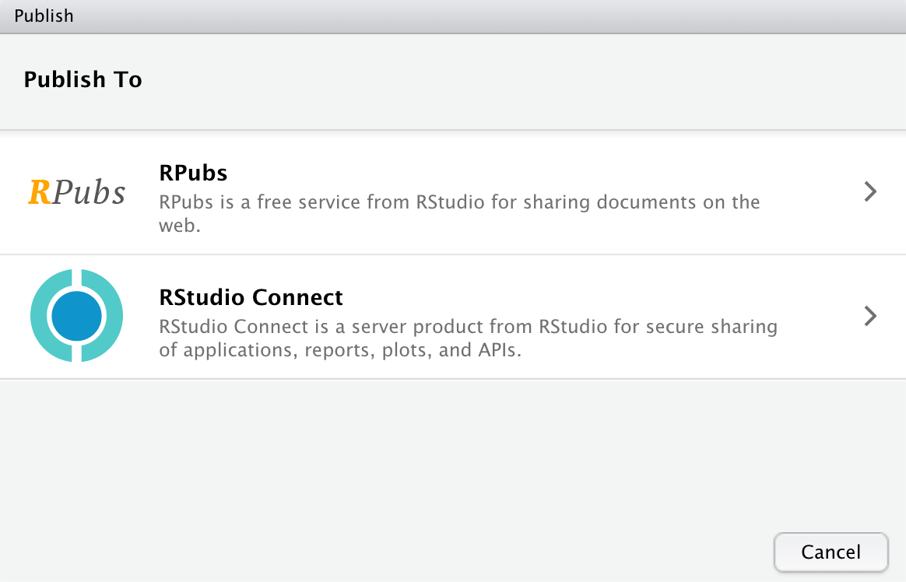
```

### Exercise 4

This will take you to the RPubs website. You will need to create an account. Follow the steps as prompted.

```{r}
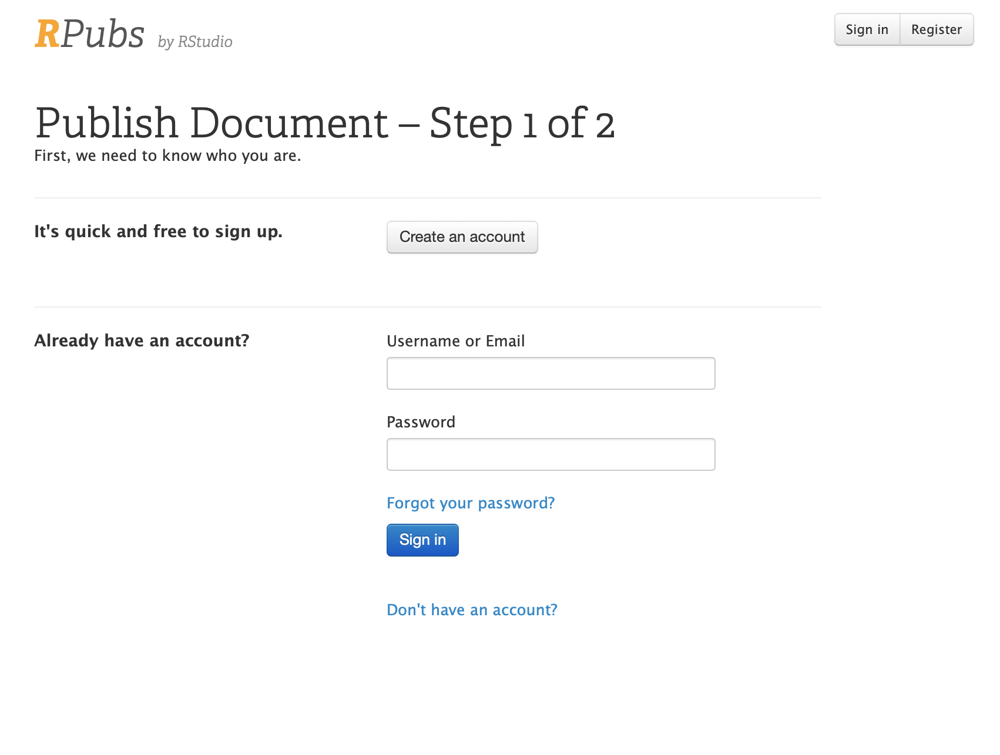
```

### Exercise 5

Add document details. Name your document. Add a meaningful slug (a unique website name that's often just the name of your project), otherwise you will end up with an ugly, long address you didn't choose and can't remember. You can leave the description blank if you don't want to add one.

Now, you should be able to publish. In the *Terminal* (the tab right next to the Console, this is the way cool people publish to Quarto Pub) type `quarto publish quarto-pub` and hit enter 2 times. The first time is validating the location of publishing, and the second time is to publish.

### 

It may take a while, but you should see a new object in your Quarto Pub profile.

### Exercise 6

Put the link to your RPubs page in the space below.

```{r publishing-6}
question_text(NULL,
    answer(NULL, correct = TRUE),
    allow_retry = TRUE,
    try_again_button = "Edita la Respuesta",
    incorrect = NULL,
    rows = 2)
```

### 

Keep in mind that this is now a website that can be found on the internet, for anyone to see.

## Summary
This tutorial covered [Chapter 3 Workflow: basics](https://r4ds.hadley.nz/workflow-basics.html),  [Chapter 5  Workflow: code style](https://r4ds.hadley.nz/workflow-style.html), [Chapter 7  Workflow: scripts and projects](https://r4ds.hadley.nz/workflow-scripts.html), and some material in [Chapter 29  Quarto](https://r4ds.hadley.nz/quarto.html) from [*R for Data Science (2e)*](https://r4ds.hadley.nz/) by Hadley Wickham, Mine Çetinkaya-Rundel, and Garrett Grolemund.

You now know how to use R projects, R scripts, Quarto documents, how to publish a page on the internet using RPubs, and how to use a plethora of useful R commands!

```{r download-answers, child = system.file("child_documents/download_answers.Rmd", package = "tutorial.helpers")}
```
